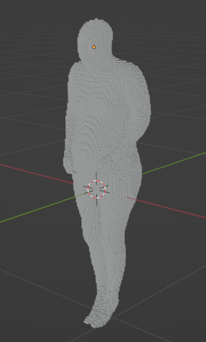

# deVox
.inp (Voxel Text File) to .obj (Wavefront) converter.

This script converts to .obj file without the texture coordinates/normals. The faces are in quad mode.

## Installation

First, clone the repository:

```bash
git clone git@github.com:memory-hunter/deVox.git
```

And then run the following command to install the dependencies.
```bash
pip install -r requirements.txt
```

## Usage

```t
usage: deVox.py [-h] input

Convert a voxel file to an obj file.

positional arguments:
  input       Input voxel file.

options:
  -h, --help  show this help message and exit
```

## Screenshots




## License
[MIT](https://choosealicense.com/licenses/mit/)
